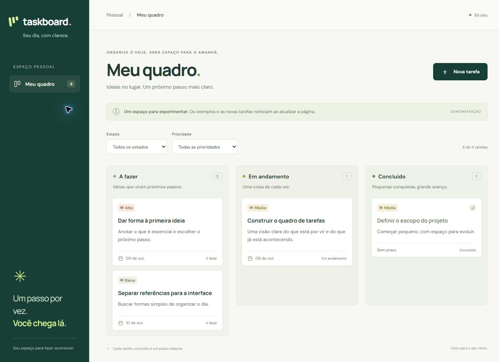

# Taskboard SDD

Quadro de tarefas pessoais em React, TypeScript e Vite, desenvolvido em etapas usando SDD.

## Estado atual

Etapa 2, realizada em **08/10/2026**: base React, interface responsiva, filtros e criação de tarefas em memória. A aplicação inicia com exemplos para facilitar a revisão visual.

**Demonstração:** as tarefas reiniciam ao atualizar a página. Edição, mudança de estado, exclusão e persistência estão planejadas para a próxima sessão.



## Objetivo

Praticar Spec-Driven Development (SDD): definir o comportamento esperado, planejar a solução, dividir a implementação em tarefas e validar o resultado contra critérios de aceite.

O usuário poderá criar, editar, excluir, organizar e filtrar tarefas. Os dados serão armazenados no navegador usando `localStorage`.

## Documentos

| Arquivo | Finalidade |
| --- | --- |
| [spec.md](spec.md) | Escopo, regras e critérios de aceite |
| [plan.md](plan.md) | Decisões técnicas e sequência de implementação |
| [tasks.md](tasks.md) | Trabalho dividido em sessões |
| [validation.md](validation.md) | Verificações vinculadas aos requisitos |
| [progress.md](progress.md) | Histórico do trabalho e próximos passos |

## Como o SDD será aplicado

1. Consultar a especificação antes de implementar cada funcionalidade.
2. Atualizar a especificação quando uma decisão alterar o comportamento esperado.
3. Implementar as tarefas relacionadas aos requisitos.
4. Executar os cenários de aceite e registrar resultados reais.
5. Manter documentos e código consistentes durante a evolução.

O projeto utiliza um fluxo leve em Markdown, inspirado no [GitHub Spec Kit](https://github.github.com/spec-kit/). O toolkit não foi instalado; os documentos foram escritos para este projeto.

## Limites da primeira versão

Uso individual, sem login ou backend. Os dados ficam no navegador e não são sincronizados entre dispositivos. Não haverá arrastar e soltar, notificações ou colaboração nesta versão.

## Execução

Pré-requisito: Node.js 20.19+ da linha 20, ou Node.js 22.12+; npm.

```sh
npm ci
npm run dev
```

Abra o endereço local informado pelo Vite. Para verificar tipos e gerar a versão de produção:

```sh
npm run check
npm run build
npm run preview
```

Use `npm run format` para formatar os arquivos de código com Prettier.

## O que já funciona

- Quadro em três estados, com prioridade e prazo identificados por texto.
- Filtros de estado e prioridade combinados, com mensagem para resultados vazios.
- Criação em A fazer, validação do título e cancelamento do formulário.
- Layout para celular e desktop, foco visível, rótulos e fechamento por Escape.

Consulte `validation.md` para os resultados verificados e as verificações pendentes. Ainda não há suíte de testes automatizados nem comando de lint.
